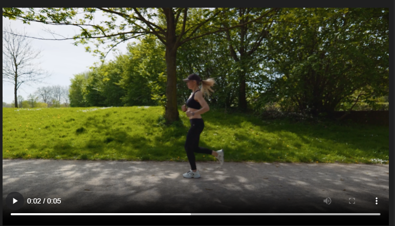
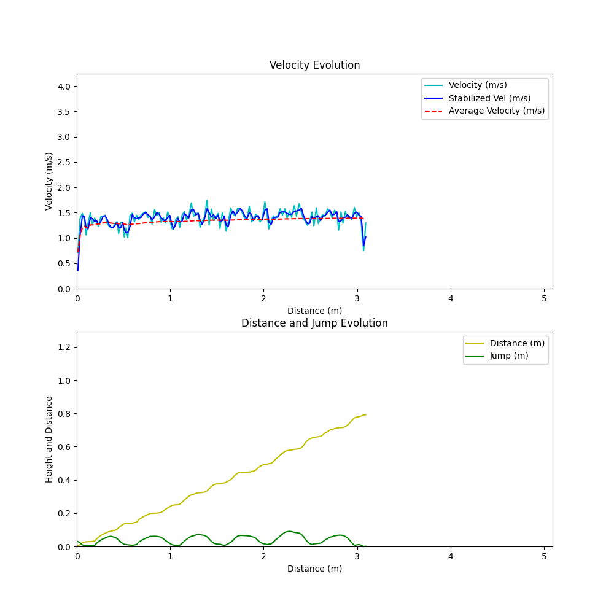
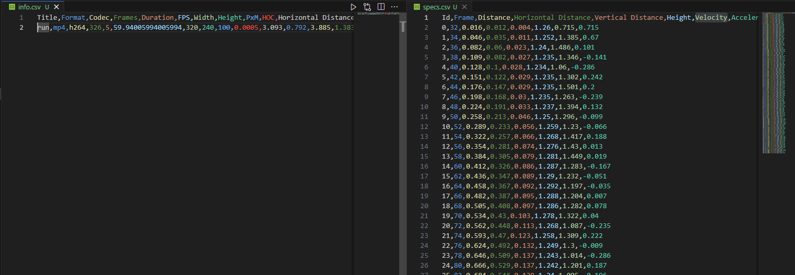

# 🏃‍♂️ Gait and Running Analysis Tool


## 🌍 Overview

This project is a video analysis tool designed to analyze human gait and running patterns. Using OpenCV and Matplotlib, it processes video files to extract metadata and perform frame-by-frame motion analysis.

## 🚀 Features

- Automatic detection of walking and running patterns
- Video metadata extraction
- Frame-by-frame movement tracking
- Visualization using Matplotlib
- Optimized for real-time analysis

## 📷 Screenshots




## 🛠️ Technologies

- **Python**
- **OpenCV**
- **Matplotlib**

## 🏗️ Installation

```bash
# Clone the repository
git clone https://github.com/denisdss/Python-Motion-Analysis-for-Running-and-Walking
cd Python-Motion-Analysis-for-Running-and-Walking

# Install dependencies
pip install -r data/requirements.dat
```

## 🚀 Usage

```bash
python main.py
```

## 📄 Project Structure

```
📦 project-root
 ┣ 📂 assets        # Video files and resources
 ┣ 📂 data          # Processed data storage
 ┣ 📂 docs          # Documentation
 ┣ 📂 src           # Source code
 ┃ ┣ 📜 controller.py   # Main processing functions
 ┃ ┣ 📜 utils.py        # Helper functions
 ┣ 📜 main.py        # Entry point for execution
```

## 🏃‍♀️ How It Works

1. Load a video of a person walking or running.
2. The algorithm detects key movement patterns.
3. It extracts motion data and visualizes the gait cycle.
4. Generates insights about speed, stride length, and symmetry.

## 🛡️ Security & Considerations

- Ensure input videos are in a supported format.
- Optimize processing time for large video files.

## 🤝 Contributing

Feel free to contribute! Fork the repository, implement improvements, and submit a pull request or open issues. Any feedback is also welcome. 🚀

## 📜 License

This project is licensed under the MIT License.

## 📬 Contact

Denis DSS - Software Engineer
[[denisdss@outlook.com](mailto\:denisdss@outlook.com)]


## ☕ Pay me a Coffee

Ethereum Network: 0x0F8D4366ff23ee657B8aC5713C4E1591976C46c2

PIX Brazilian Network: fc6efbb0-287c-498c-b4aa-e5c70578d6ab

Paypal Donation: https://www.paypal.com/donate/?business=P2HRRJZ3YZWHW&currency_code=USD

Buy me a coffee APP: http\://buymeacoffee.com/denisdss


